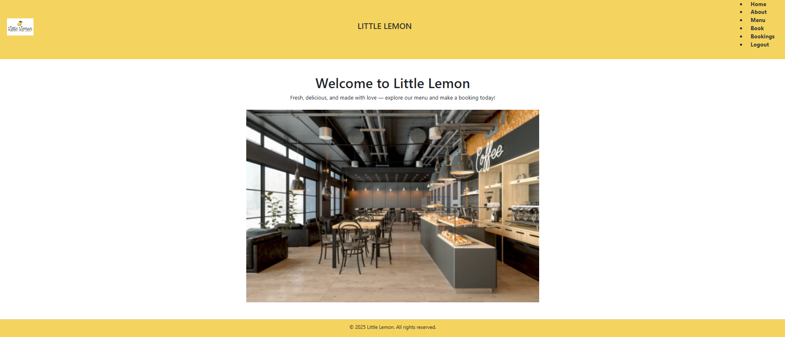
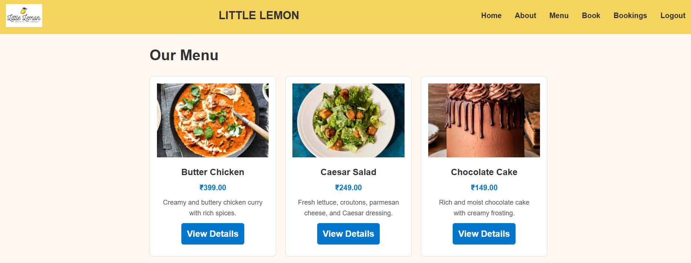

# 🍋 Little Lemon Restaurant (Django Project)

A full-stack **Django web application** for the fictional restaurant **Little Lemon**.  
It includes features like menu display, booking system, user authentication, and image carousel on the homepage.

---

## 🚀 Features
- 🏠 **Homepage** with restaurant images (slideshow).
- 
- 📖 **About Page** describing Little Lemon.
- 🍽 **Menu Page** with dish images, prices, and details.
- 
- 📌 **Bookings Section** to make and view reservations.
- 🔑 **User Authentication** (Login / Logout).
- 🎨 Responsive design using **Bootstrap 5**.
- 🗄 Uses **SQLite** by default (can be switched to PostgreSQL/MySQL).

---

## ⚙️ Tech Stack
- **Backend**: Django 5.x (Python)
- **Frontend**: HTML, CSS, Bootstrap
- **Database**: SQLite (default)
- **Version Control**: Git & GitHub

---

## 📂 Project Structure
littlelemon/
├── restaurant/ # Main app (menu, bookings, etc.)
├── littlelemon/ # Project settings
├── media/ # Uploaded images (menu, homepage, etc.)
├── static/ # CSS, JS, and static assets
├── templates/ # HTML templates
├── db.sqlite3 # Database (default)
└── manage.py # Django management script


---

## 🔧 Setup Instructions

1. Clone the repository:
   ```bash
   git clone https://github.com/shivamprt-07/little-lemon-django.git
   cd little-lemon-django
2. Create & activate a virtual environment:

    python -m venv venv
    source venv/bin/activate   # On Mac/Linux
    venv\Scripts\activate      # On Windows

3. Install dependencies:

pip install -r requirements.txt

4. Apply migrations:

python manage.py migrate

5. Create a superuser (admin):

python manage.py createsuperuser

6. Run the server:

python manage.py runserver

7. Open in browser:
👉 http://127.0.0.1:8000/
